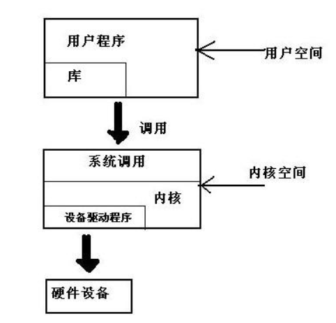

linux程序设计笔记

<!-- more -->

### shell语法
#### 变量
声明:不需要声明,直接赋值;区分大小写;变量存储类型是字符串;使用read 变量名 来用这个变量名保存用户输入字符串
访问:变量前面加$
注意空格

* 引号: 单引号,双引号  反斜杠
* 环境变量 大写字母
  * $HOME
  * $PATH
  * $PS1:命令提示符如#,$
  * $PS2:二级命令提示符如>
  * $IFS:输入域分隔符,通常是空格
  * $0:shell脚本的名字
  * $#:传递脚本参数个数
  * $$:进程号
* 参数变量
  * $1,$2,...:脚本程序的参数
  * $*:列出所有参数,使用环境变量中的IFS
  * $@:$*的变体,即使IFS为空,参数也不会挤在一起

#### 条件
test / [ 命令   
如果把then 和if 放在同一行必须用;把test语句和then分隔开
 * 字符串比较
 * 算数比较
 * 文件条件测试

#### 控制结构
 * if ... then ... elif ... then ... else ... fi
 * for ... in ... do ... done
 * while ... do ... done
 * case ... in ... ... ) ...;;esac
 * 命令列表
    * AND && 前面的命令执行成功的情况下,才执行后面的命令
    * OR || 前面一条命令执行失败才执行后面的命令

#### 函数
 声明:fun_name(){}
 调用:fun_name

#### 命令
 * break
 * :
 * continue
 * .
 * echo
 * eval
 * exec
 * exit n
 * export
 * expr
 * printf
 * return
 * set
 * shift
 * trap
 * unset
 * find
 * grep

#### 命令的执行
 * 算数扩展 : $(())
 * 参数扩展 : ${param:-default} ...

#### here 文档
 * << !xxx!

#### 调试
 * sh -n/v/x/u

### 文件操作

#### 文件和设备
* /dev/console
* /dev/tty
* /dev/null

#### 系统调用和库函数
 * 系统调用:由系统直接提供直接对文件和设备的访问和控制的底层函数
 * 库函数:对设备和磁盘文件提供更高层的接口
 

#### 底层文件访问
一些系统调用
 * write
 * read
 * open 
 * close 
 * ioctl
 * lseek
 * fstat, stat, lstst
 * dup, dup2

#### 标准IO库
 * fopen,fclose
 * fread,fwrite
 * fflush
 * fseek
 * fgetc, getc, getchar
 * fputc, putc, putchar
 * fgets, gets
 * printf, fprintf, sprintf
 * scanf, fscanf, sscanf

#### 文件和目录维护
 * chmod
 * chown
 * unlink, link, symlink
 * mkdir, rmdir
 * chdir

#### 扫描目录
 * opendir
 * readdir
 * telldir
 * seekdir
 * closedir

#### 错误处理
 * strerror
 * perror

#### /proc 文件系统
包含了许多特殊文件用来对驱动程序和内核信息进行更高层的访问

### Linux 环境
#### 向程序传递参数
* getopt
* getopt_long

#### 环境变量
 * 用途: 采用环境变量改变程序运行方式,类似全局变量
 * environ变量: 通过这个变量访问字符串数组

#### 时间和日期
 * time, difftime, gmttime, localtime, mktime, asctime, ctime, strftime, strptime

#### 临时文件
 * tmpnam, tmpfile

###  数据管理

#### 内存管理
 * 简单的内存分配:malloc
 * 分配大量内存: 交换空间
 * 滥用内存: segmentation error
 * 空指针: segmentation error
 * 释放内存: free

#### 文件锁定
 * 创建锁文件
 * 区域锁定
   * 共享(读)锁:有共享锁时,不能获得独占锁
   * 解锁:
   * 独占(写)锁:有独占锁时,不能有其他锁

### 进程和信号

#### 进程的结构,类型和调度
 * 进程的结构:有自己的栈空间,保存局部变量和函数的调用和返回,有自己的环境空间,包含为这个进程建立的环境变量.
   * 进程表
   * 查看进程 ps a/f/x/e/u    PID/PPID/TTY/CMD/STAT/
   * 系统进程 
   * 进程调度 nice
 * 启动新进程:
   * system : 程序必须等待由system函数启动的进程结束之后才能继续
   * 替换进程映像 exec: 把当前进程替换为一个新的进程,原来的进程不再执行
   * 复制进程映像 fork:父进程返回子进程pid,子进程返回0 这样可以区分两个进程
 * 等待一个进程 wait: 父进程中调用wait
 * 僵尸进程: 子进程运行结束 ,由于需要保存返回给父进程的信息所以依然存在系统中.这个时候就是僵尸进程,知道父进程调用wati 或者正常结束
 * 线程: 进程可以相互协作,互相发送消息,互相中断,甚至可以共享内存段.但是想要共享变量不太可能.于是有了线程

#### 信号
信号是UNIX/LINUX 系统响应某些条件而产生的一个事件.用raise/生成表示一个信号的产生,用catch/捕获表示接收一个信号
 * SIG... 
 * 发送信号: kill

### POSIX线程

#### 在进程中创建新线程
 * pthread_create : 类似于进程中的fork
 * pthread_exit: 类似于exit
 * pthread_join: 类似于pthread_wait

#### 在一个进程中同步线程之间的数据访问
 * 信号量:他的作用如同看守一段代码的看门人
   * sem_init
   * sem_wait
   * sem_post
   * sem_destroy
 * 互斥量: 他的作用如同保护代码的一个互斥设备
   * pthread_mutex_init
   * pthread_mutex_lock
   * pthread_mutex_unlock
   * pthread_mutex_destroy

#### 线程的属性
#### 取消一个线程
 * pthread_cancel

### 进程间通信:管道
#### 管道
从一个进程连接数据流到另外一个进程时
#### 进程管道
 * popen
 * pclose

#### pipe调用
 * pipe(int file_descriptor[2])   向file_descriptor[1]中写数据 从file_descriptor[0]中读数据 先进先出
 * 调用pipe(..) 成功后 fork , 然后在子进程读,父进程写,就可以实现进程间的通信

#### 子进程和父进程
 * 上个例子中由于fork之后文件描述符变量也会在两个进程中存在,因此在同一个程序中可以很方便的通信.如果其中一个进程需要执行别的程序呢? 这时候需要用exec来启动一个新的程序,然后把文件描述符传给这个程序就可以实现两个不同程序之间的进程的通信
 * 管道关闭后的读操作:对已关闭写数据的管道进行读操作将返回0.fork之后只有当父子进程中的写数据的管道都关闭时,对管道的读操作才会失败
 * 把管道用作标准输入和标准输出:dup() 复制文件描述符,返回最小的文件描述符.fork之后子进程把0(标准输入)关了,然后dup管道读文件的描述符[0],返回标准输入0.然后关掉原来管道读描述符,管道写描述符.父进程同理
 
#### FIFO 命名管道
 * 以上还是只能再相关程序之间传递数据,即由共同祖先进程启动的
 * mknod / mkfifo(优先使用)
 * cat < fifofile & , echo helloworld > fifofile 
 * 访问fifo文件: open 但是不能以读写的方式打开 

### 信号量,共享内存,消息队列

#### 信号量
#### 共享内存
#### 消息队列

### 套接字

#### 套接字连接的工作原理
 * 套接字是一种通信机制,凭借这种机制,客户端/服务端系统的开发工作既可以在本地进行,也可以跨网络进行.
 * 套接字如何连接?
     * 服务端
         * socket 调用创建一个套接字
         * bind调用 命名 本地 系统文件名(/tmp 或者/usr/tmp), 网络 服务标识符(端口或者访问点)
         * listen调用 创建一个队列并将其用于存放来自客户端的连接
         * accept调用 接收客户端的连接
     * 客户端
         * socket 调用创建一个套接字
         * connect 以服务端的命名套接字作为一个地址来调用connect与服务器建立连接
     * 套接字属性
         * 域domain  最常见的是AF_INET 指的是internet 底层协议为IP协议
         * 类型
             * 流套接字SOCK_STREAM 底层由TCP/IP实现
             * 数据报套接字 SOCK_DGRAM UDP/IP实现
             * 套接字协议
